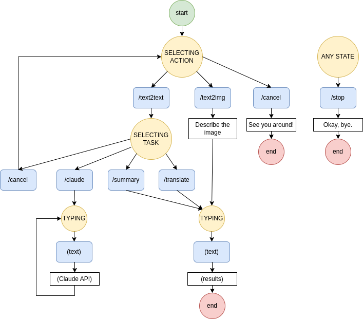

## MLToolsBot

  

This is repository for [telegram bot](https://t.me/MLToolsBot) which helps user with tasks using machine learning through communication and commands. Could be used in inline mode.

_To use this bot user mast be logged in. Context saves to redis._

**text2text** - generate response according to your request
-- **summarize** - summarize input text and end.
-- **translate** - translate input to english and end.
-- **claude** - start conversation with claude-3.5-sonnet model. Next text messages would be considered as conversation till /stop command.
-- **yandex** - general conversation with yandex-gpt model. Next text messages would be considered as conversation till /stop command.
**text2img** - create image according to your description using yandex-art

There are just a few commands:

- /start - start conversation
- /stop - end conversation
- /help

### State Diagram

